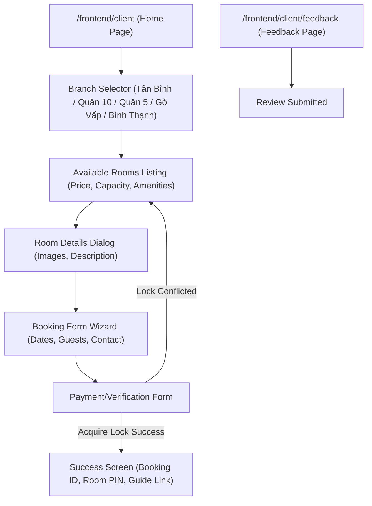
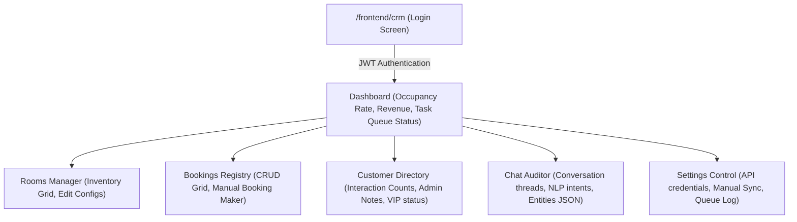

# Sitemap & URL Routing Architecture: Bliss Homestay AI Hub v3.0

This document defines the official directory structure, URL routing layout, and sitemap flow for the Bliss Homestay AI Hub v3.0. The architecture aligns with the technical specifications in [technical_design.md](file:///D:/HOMENEST%20-%20QUESTX/DAR/bliss/docs/technical_design.md) and integrates critical architectural fixes from [design_critique.md](file:///D:/HOMENEST%20-%20QUESTX/DAR/bliss/docs/design_critique.md).

To balance low-cost operation with enterprise reliability, the application utilizes **Google Sheets** as the main system of record (the central database) and integrates a local, persistent **SQLite database** to manage high-frequency operations, locks, deduplication, and queues.

---

## 1. Directory Structure

Below is the directory tree of the restructured application. This structure separates concerns between the server side (`src/backend`), the client-facing booking interface (`src/frontend/client`), and the administrative interface (`src/frontend/crm`).

```text
bliss/
├── .env                              # Sensitive environment variables (git-ignored)
├── .gitignore                        # Git configuration to ignore env, dependencies, & local db
├── package.json                      # Node.js dependencies and run scripts
├── start.js                          # Launcher that bootstraps the Express app
├── data/
│   └── bliss_local.db                # SQLite database (persisted queue, locks, deduplication)
├── docs/
│   ├── design_critique.md            # Critique of architecture limits
│   ├── sitemap_routing.md            # [Current File] Sitemap and routing guide
│   └── technical_design.md           # v3.0 core design specification
├── images/                           # Shared image assets for room views
│   ├── room_1_main.png
│   └── ...
├── src/
│   ├── backend/                      # Node.js/Express server source
│   │   ├── server.js                 # Application entry point & middleware registry
│   │   ├── config/                   # Configuration adapters
│   │   │   ├── db.js                 # SQLite schema initialization and connection
│   │   │   └── sheets.js             # Google Sheets API (googleapis) client config
│   │   ├── controllers/              # Request controllers
│   │   │   ├── bookingController.js  # Booking REST API handler
│   │   │   ├── customerController.js # Customer profile REST API handler
│   │   │   ├── roomController.js     # Room configuration REST API handler
│   │   │   ├── syncController.js     # Cache and sheet sync endpoint
│   │   │   └── webhookController.js  # Webhook handlers (FB, TG, WA)
│   │   ├── middleware/               # Express request interceptors
│   │   │   ├── auth.js               # JWT verify & secure webhook signature comparison
│   │   │   ├── deduplicate.js        # SQLite-based message deduplication
│   │   │   └── rateLimiter.js        # IP/phone API rate limiter
│   │   ├── routes/                   # Routing configuration
│   │   │   ├── api.js                # Router for /backend/api/* endpoints
│   │   │   ├── webhooks.js           # Router for /webhook/* webhooks
│   │   │   └── frontend.js           # Router for serving static UI assets
│   │   └── services/                 # Core server logic
│   │       ├── automation.js         # Automated notifications, tags & PIN code generation
│   │       ├── chatbot.js            # Social messaging State Machine engine
│   │       ├── lockService.js        # SQLite distributed-locking implementation
│   │       ├── nlp.js                # Offline Vietnamese NLP and Gemini parser
│   │       ├── queueService.js       # Transactional SQLite write-behind queue processor
│   │       └── sheetsService.js      # Google Sheets spreadsheet batch synchronizer
│   └── frontend/                     # HTML/CSS/JS frontend application resources
│       ├── client/                   # Public-facing room booking client
│       │   ├── css/
│       │   │   └── client.css        # Client styles
│       │   ├── js/
│       │   │   └── clientApp.js      # Client application core logic (fetch, forms, views)
│       │   └── index.html            # Main booking landing page
│       └── crm/                      # Boutique CRM admin dashboard (refactored SPA)
│           ├── css/
│           │   └── crm.css           # Dashboard layout and component styles
│           ├── js/
│           │   ├── controllers/
│           │   │   └── crmController.js # Frontend MVC application controller
│           │   ├── views/            # Frontend View components (SPA components)
│           │   │   ├── dashboardView.js
│           │   │   ├── bookingsView.js
│           │   │   ├── roomsView.js
│           │   │   ├── customersView.js
│           │   │   ├── chatLogsView.js
│           │   │   └── settingsView.js
│           │   └── crmApp.js         # CRM front-end entry point
│           └── index.html            # Boutique Web UI SPA frame
```

### 1.1 Local SQLite Database Schema (`data/bliss_local.db`)
The SQLite layer implements four key tables to protect application state:
1. **`locks` Table**: Manages room availability locks with atomic write-checks to prevent race conditions during booking.
   * `room_id` (TEXT), `check_in_date` (TEXT), `check_out_date` (TEXT), `expires_at` (INTEGER/Timestamp).
2. **`deduplication` Table**: Keeps track of processed messaging platform IDs to prevent webhook replays and duplicated chatbot replies.
   * `message_id` (TEXT - Primary Key), `processed_at` (INTEGER/Timestamp).
3. **`write_queue` Table**: Stores pending write actions destined for Google Sheets, preventing data loss in the event of an unexpected server crash.
   * `id` (INTEGER - PK), `type` (TEXT - e.g., 'CREATE_BOOKING'), `payload` (TEXT - JSON), `attempts` (INTEGER), `status` (TEXT), `created_at` (INTEGER).
4. **`chat_logs` Table**: Stores messaging interactions locally, serving as a buffer to avoid exceeding Google Sheets write quotas.
   * `log_id` (TEXT - PK), `social_id` (TEXT), `channel` (TEXT), `sender_role` (TEXT), `message_content` (TEXT), `parsed_intent` (TEXT), `parsed_entities` (TEXT - JSON), `timestamp` (INTEGER).

---

## 2. URL Routing Architecture

The routing map is grouped into three main Express path trees: `/frontend` (client and admin user interfaces), `/backend` (REST API data actions), and `/webhook` (channel messaging webhooks).

| Route Group | Method | Path | Controller Handler | Access Level | Description |
| :--- | :--- | :--- | :--- | :--- | :--- |
| **Frontend** | `GET` | `/frontend` | Static Redirect | Public | Redirects root user to the Client booking application. |
| **Frontend** | `GET` | `/frontend/client` | `frontend.js` | Public | Serves client booking landing page (`src/frontend/client/index.html`). |
| **Frontend** | `GET` | `/frontend/crm` | `frontend.js` | Admin (Cookie) | Serves Boutique CRM dashboard app (`src/frontend/crm/index.html`). |
| **Backend API** | `GET` | `/backend/api/rooms` | `roomController.getRooms` | Public / Admin | Returns list of rooms, optionally filtered by `branch` and `status`. |
| **Backend API** | `POST`| `/backend/api/rooms` | `roomController.createRoom` | Admin (JWT) | Adds a new room to the in-memory cache and queues Google Sheets sync. |
| **Backend API** | `PUT` | `/backend/api/rooms/:id` | `roomController.updateRoom` | Admin (JWT) | Edits existing room configuration in cache and queue. |
| **Backend API** | `DELETE`| `/backend/api/rooms/:id` | `roomController.deleteRoom` | Admin (JWT) | Soft-deletes a room (toggles status to `inactive`). |
| **Backend API** | `GET` | `/backend/api/bookings` | `bookingController.getBookings` | Admin (JWT) | Returns bookings, filterable by `branch`, `status`, and `date`. |
| **Backend API** | `POST`| `/backend/api/bookings` | `bookingController.createBooking` | Public / Admin | Manually creates a booking transaction; validates SQLite locks. |
| **Backend API** | `PUT` | `/backend/api/bookings/:id`| `bookingController.updateBooking`| Admin (JWT) | Updates booking status (`checked_in`, `checked_out`, etc.). |
| **Backend API** | `GET` | `/backend/api/customers` | `customerController.getCustomers` | Admin (JWT) | Returns list of customer profiles and social identities. |
| **Backend API** | `GET` | `/backend/api/customers/:id` | `customerController.getCustomer` | Admin (JWT) | Returns single customer details and direct log interactions. |
| **Backend API** | `PUT` | `/backend/api/customers/:id` | `customerController.updateCustomer` | Admin (JWT) | Edits customer profile details, notes, and VIP ranking. |
| **Backend API** | `GET` | `/backend/api/chat-logs` | `customerController.getChatLogs` | Admin (JWT) | Returns local SQLite buffered chat log feed. |
| **Backend API** | `POST`| `/backend/api/sync-cache` | `syncController.syncCache` | Apps Script webhook| Receives direct cell update notice from Sheet to update cache. |
| **Webhooks** | `GET` | `/webhook/facebook` | `webhookController.verifyFB` | Meta Webhook Verify| Verification handshakes with Meta Developers platform. |
| **Webhooks** | `POST`| `/webhook/facebook` | `webhookController.handleFB` | Verified Meta Signature| Accepts Facebook events; verifies via Meta App Secret HMAC. |
| **Webhooks** | `POST`| `/webhook/telegram` | `webhookController.handleTG` | Verified Telegram Token| Accepts Telegram update events; verifies custom header token. |
| **Webhooks** | `GET` | `/webhook/whatsapp` | `webhookController.verifyWA` | Meta Webhook Verify| Verification handshakes with Meta Developer platform for WA. |
| **Webhooks** | `POST`| `/webhook/whatsapp` | `webhookController.handleWA` | Verified WA Signature | Accepts WhatsApp events; verifies via Meta App Secret HMAC. |

### 2.2 Security Middleware Enforcements
- **JWT Verification**: Admin API requests under `/backend/api/*` must pass a valid JWT header (`Authorization: Bearer <token>`).
- **Timing-Safe HMAC Verification**: Handlers `/webhook/facebook` and `/webhook/whatsapp` use `crypto.timingSafeEqual` to check signature matches, protecting against microsecond-level timing analysis attacks.
- **Message Deduplication**: Webhook routes run through `deduplicate.js` middleware, matching message hashes against the SQLite database before forwarding them to state machines.

---

## 3. Sitemap & Navigation Flows

### 3.1 Client Booking Frontend Sitemap
The customer-facing application is a lightweight, responsive interface optimized for speed and conversion.



*   **States & Views**:
    *   **Browser View**: Visual selection of location and viewing active homestay rooms.
    *   **Details Modal**: Displays layout details, list of amenities, and visual slides.
    *   **Wizard View**: Dynamic forms asking for check-in/out dates, guest counts, and guest contact info.
    *   **Booking Success View**: Displays unique Booking Code (e.g. `BL006`), automatically generated PIN door codes, and links to branches' digital instruction folders.

---

### 3.2 CRM Frontend Sitemap (Boutique Web UI)
The administration CRM is structured as a Single Page Application (SPA), dynamically swapping views inside `src/frontend/crm/index.html`.



*   **Interactive Components & Triggers**:
    *   **Dashboard View**: Displays performance graphs (monthly revenue, room occupancy trends) and live queue synchronizer statuses.
    *   **Rooms Manager**: Contains action buttons to create new rooms, edit room specs (weekday/weekend rates, images, emojis), and soft-delete active rooms.
    *   **Bookings Registry**: Lists homestay bookings. Administrators can filter bookings by status or location and manually trigger check-in/out updates (which auto-send PIN door codes or reviews).
    *   **Chat Auditor**: Presents chat messages parsed by the state machine and Gemini NLP. Administrative staff can override automated bot replies and chat directly with customers.
    *   **Settings Control**: Displays SQLite write queue logs, allows testing Google Sheets connections, and triggers a full cache rebuild.

---

## 4. Critique Resolutions Integration

The restructured file directory layout and URL endpoint routing incorporate concrete solutions to the security and scalability problems identified in [design_critique.md](file:///D:/HOMENEST%20-%20QUESTX/DAR/bliss/docs/design_critique.md):

### 4.1 Concurrency & Horizontal Scaling
*   **Problem**: In-memory locking maps break when scaling horizontally across multiple processes or server instances.
*   **Resolution**: Implemented SQLite-based locking inside `src/backend/services/lockService.js` referencing the local `locks` database table. All backend routes and webhook state machines must perform an atomic insert check in SQLite. The locks expire automatically using an embedded TTL timeout (5 minutes), preventing abandoned lock leaks.

### 4.2 Stale Cache Avoidance
*   **Problem**: Server cache becomes outdated if administrators edit room rates or bookings directly in Google Sheets.
*   **Resolution**: Created the `/backend/api/sync-cache` endpoint inside `src/backend/routes/api.js`. It receives cell change notices via a Google Apps Script trigger configured on the Google Sheet. Additionally, a periodic cache polling background script executes every 60 seconds to pull sheet metadata and refresh the cache.

### 4.3 Data Loss Prevention
*   **Problem**: High-speed, write-behind memory queues lose all reservations if the Node process crashes before syncing to Google Sheets.
*   **Resolution**: All write actions are recorded to the SQLite `write_queue` table *before* the application returns success responses to clients or users. The worker `src/backend/services/queueService.js` reads this persistent SQLite table, processes writes to Google Sheets, and only deletes entries upon confirmation of a successful write.

### 4.4 Webhook Duplicate Deliveries
*   **Problem**: Platforms like Meta retry webhooks if processing takes longer than 3 seconds (e.g. during Gemini AI inference calls), leading to duplicate API runs and duplicate bookings.
*   **Resolution**: Embedded `src/backend/middleware/deduplicate.js` in all webhook paths. It checks incoming payload IDs against a fast SQLite table. If a duplicate ID is found, it sends an immediate `200 OK` and discards the duplicate execution.

### 4.5 Google Sheets Quota Management
*   **Problem**: Real-time writing of chat transcripts to Google Sheets quickly consumes the 300 write requests per minute API limit.
*   **Resolution**: Message details are logged directly to the local SQLite `chat_logs` table. A background service batches these logs and periodically flushes them to Google Sheets in bulk using a single `batchUpdate` API call every 5 minutes or 100 entries, saving precious quota.

### 4.6 24-Hour Messaging Policy Enforcement
*   **Problem**: WhatsApp and Facebook Messenger restrict standard messaging outside a 24-hour window from the user's last message, causing failure in automated check-in and checkout reminders.
*   **Resolution**: Built rules into `src/backend/services/automation.js` to automatically attach approved Meta Message Tags (like `CONFIRMED_EVENT_UPDATE`) for Messenger notifications, and inject parameters into pre-registered WhatsApp template APIs when notifying users outside the 24-hour window.

### 4.7 Timing Attack Mitigation
*   **Problem**: Using simple string checks (`===`) inside verification code leaves the application vulnerable to timing side-channel attacks.
*   **Resolution**: Upgraded verification in `src/backend/middleware/auth.js` to utilize `crypto.timingSafeEqual` for validation of Meta SHA-256 HMAC headers and Telegram Bot private tokens in constant time.

### 4.8 Secrets Exposure Avoidance
*   **Problem**: Credentials and page tokens committed directly inside code files like `facebook-bot-server.js` get leaked to source control.
*   **Resolution**: Hardcoded keys are completely removed. A secure `.env` file houses all configurations and keys. The files `.env` and `data/bliss_local.db` are added to the `.gitignore` configuration. Configuration variables are pulled strictly via `process.env` in `src/backend/config/`.
