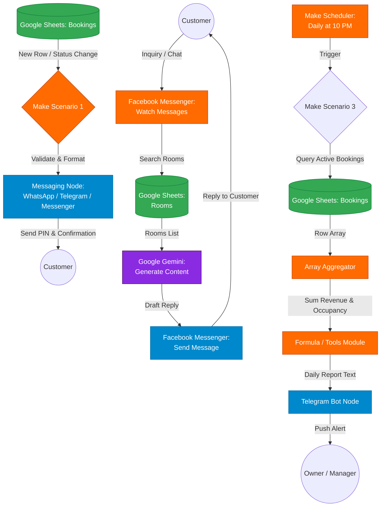

# Bliss Homestay: Make.com Workflow Automation Guide

Tài liệu này cung cấp hướng dẫn chi tiết cách thiết lập, cấu hình và vận hành các kịch bản tự động hóa trên **Make.com** (hoặc **Make.ai**) dành cho **Bliss Homestay**, tích hợp Google Sheets (Cơ sở dữ liệu), Trí tuệ nhân tạo (Google Gemini) và các kênh mạng xã hội (Facebook Messenger, Telegram, WhatsApp) để tự động hóa quy trình đặt phòng và chăm sóc khách hàng tại 5 chi nhánh Sài Gòn (CS1 đến CS5).

---

## Tổng Quan Kiến Trúc Tự Động Hóa



---

## KỊCH BẢN 1: Tự động Gửi Xác Nhận Đặt Phòng & Mã PIN Khóa Số

### Mục tiêu
Mỗi khi có một đặt phòng mới được xác nhận (hoặc được tạo) trong Google Sheets, hệ thống tự động định dạng tin nhắn, lấy mã PIN khóa số, và gửi trực tiếp tới kênh liên lạc của khách hàng (Zalo, Telegram, WhatsApp, hoặc Facebook Messenger).

### Bước 1: Cấu trúc bảng Google Sheets (Bảng Bookings)
Bảng **`Bookings`** của bạn cần có các cột tiêu đề tại dòng 1 như sau:

| Cột | Tên Cột | Mô tả / Định dạng |
|:---|:---|:---|
| **A** | `booking_id` | Mã đặt phòng (ví dụ: `BL001`, `BL002`) |
| **B** | `customer_name` | Tên khách hàng |
| **C** | `customer_phone` | Số điện thoại liên hệ (định dạng `090xxxxxxx`) |
| **D** | `source` | Kênh gửi tin nhắn: `facebook`, `telegram`, hoặc `whatsapp` |
| **E** | `customer_social_id` | ID chat của khách trên kênh đó (ví dụ: chat ID Telegram hoặc PSID Messenger) |
| **F** | `room_name` | Tên phòng (ví dụ: `Phòng Việt Nam`, `Cinebox Mario`) |
| **G** | `check_in_date` | Ngày nhận phòng (`YYYY-MM-DD`) |
| **H** | `check_out_date` | Ngày trả phòng (`YYYY-MM-DD`) |
| **I** | `total_price` | Tổng số tiền thanh toán |
| **J** | `payment_status` | Trạng thái thanh toán: `paid`, `pending` |
| **K** | `checkin_status` | Trạng thái nhận phòng: `checked_in`, `pending` |
| **L** | `notification_sent` | Trạng thái gửi tin nhắn: Để trống hoặc ghi `Yes` để tránh gửi trùng |

### Bước 2: Thiết kế kịch bản trên Make.com
Sử dụng các module liên tiếp:

1.  **Google Sheets (Watch Rows)**:
    *   **Spreadsheet / Sheet**: Chọn bảng quản lý của bạn, sheet `Bookings`.
    *   **Table contains headers**: Chọn `Yes`.
    *   **Limit**: `10`.
2.  **Filter (Bộ lọc giữa Google Sheets và Router)**:
    *   **Label**: `Kiểm tra xem đã gửi chưa`
    *   **Điều kiện lọc**:
        *   `notification_sent` **Does not exist** (hoặc **Not equal to** `Yes`)
3.  **Router**: Chia nhánh dựa theo trường `source` (kênh gửi).
    *   **Nhánh A (Facebook Messenger)**: Điều kiện lọc: `source` **Equal to** `facebook`.
        *   Module tiếp theo: **Facebook Messenger (Send a Message)**.
        *   **Recipient ID**: Mapped từ `customer_social_id`.
        *   **Message Text**:
            ```text
            Chào {{customer_name}}! 🌿
            Đặt phòng của bạn tại Bliss Homestay đã được XÁC NHẬN thành công.
            🏨 Tên phòng: {{room_name}}
            📅 Ngày nhận phòng: {{check_in_date}} (sau 14h00)
            📅 Ngày trả phòng: {{check_out_date}} (trước 12h00)
            💰 Tổng tiền: {{total_price}} đ

            🔐 Mã PIN khóa số nhận phòng tự động (Self Check-in):
            👉 6789##
            (Mã số sẽ có hiệu lực từ 14h00 ngày nhận phòng đến 12h00 ngày trả phòng).
            Chúc bạn có chuyến đi thật vui vẻ! 😊
            ```
    *   **Nhánh B (Telegram)**: Điều kiện lọc: `source` **Equal to** `telegram`.
        *   Module tiếp theo: **Telegram Bot (Send a Text Message or Reply)**.
        *   **Chat ID**: Mapped từ `customer_social_id`.
        *   **Text**: Nhập tin nhắn định dạng Markdown tương tự nhánh A.
    *   **Nhánh C (WhatsApp)**: Điều kiện lọc: `source` **Equal to** `whatsapp`.
        *   Module tiếp theo: **WhatsApp Business API (Send a Message)**.
4.  **Google Sheets (Update a Row)**:
    *   Gắn module này ở cuối mỗi nhánh để đánh dấu đã gửi.
    *   **Row number**: Map biến `Row number` từ bước 1.
    *   **notification_sent**: Nhập `Yes`.

---

## KỊCH BẢN 2: Trực Fanpage Tự Động Bằng AI (Messenger ➔ Sheets ➔ Gemini ➔ Messenger)

### Mục tiêu
Khi khách hàng gửi tin nhắn đến Facebook Messenger Page, Make.com tự động kích hoạt. Nó sẽ tra cứu danh sách phòng hoạt động thực tế từ Google Sheets, gửi cho Gemini phân tích nhu cầu và soạn thảo câu trả lời thông minh, sau đó tự động nhắn lại cho khách hàng.

### Sơ đồ luồng Make.com chi tiết

```text
[Facebook Messenger] ➔ [Google Sheets] ➔ [Google Gemini] ➔ [Facebook Messenger]
 (Watch Messages)       (Search Rows)      (Generate Content)     (Send a Message)
```

### Hướng dẫn cấu hình từng bước

#### 1. Module 1: Facebook Messenger (Watch Messages)
*   **Mục đích**: Nhận tin nhắn mới tức thì từ Fanpage của bạn.
*   **Cấu hình**:
    *   Click **Add** để đăng nhập tài khoản Facebook chứa Fanpage của bạn.
    *   Chọn đúng Fanpage quản lý Bliss Homestay.
    *   Make.com sẽ tự động tạo một Webhook kết nối bảo mật đến trang của bạn.

#### 2. Module 2: Google Sheets (Search Rows)
*   **Mục đích**: Lấy danh sách 59 phòng đang hoạt động và địa chỉ thực tế từ Sheets gửi cho AI.
*   **Cấu hình**:
    *   **Connection**: Chọn tài khoản Google của bạn.
    *   **Spreadsheet**: Chọn bảng quản lý Bliss.
    *   **Sheet**: Chọn sheet **`Rooms`**.
    *   **Filter**: Chọn cột `status` **Equal to** `active`.
    *   Click **OK** để lưu.

#### 3. Module 3: Google Gemini (Generate Content)
*   **Mục đích**: Đọc tin nhắn của khách, đọc danh sách phòng, và viết câu trả lời.
*   **Cấu hình**:
    *   **Model**: Chọn `gemini-1.5-flash` (tốc độ xử lý nhanh, phản hồi tự nhiên).
    *   **Prompt (Hệ thống)**: Sao chép và dán prompt sau:
        ```text
        Bạn là Trợ lý ảo AI cực kỳ nhiệt tình, mến khách và chuyên nghiệp của chuỗi homestay Bliss Homestay tại TP.HCM.
        Hãy đọc danh sách các phòng và địa chỉ thực tế từ cơ sở dữ liệu Google Sheets dưới đây để tư vấn chính xác nhất cho khách hàng:

        ---
        DANH SÁCH PHÒNG ĐANG HOẠT ĐỘNG:
        {{2.output}} 
        (Hãy kéo thả biến đầu ra chứa danh sách các dòng của module Google Sheets vào đây)
        ---

        QUY ĐỊNH CHUNG CỦA BLISS:
        - Giờ nhận phòng (check-in): sau 14h00. Giờ trả phòng (check-out): trước 12h00.
        - Mật khẩu WiFi tại các chi nhánh: Tên mạng: "BlissHome" | Mật khẩu: "bliss2024".
        - Tiện ích: Đỗ xe máy miễn phí. Ô tô vui lòng liên hệ trước để check vị trí.

        QUY TẮC PHẢN HỒI:
        1. Trả lời thân thiện bằng tiếng Việt, xưng hô lịch sự (ví dụ: dạ, vâng, chúng mình...).
        2. Nếu khách hỏi tìm phòng hoặc hỏi về chi nhánh cụ thể (Tân Bình, Quận 10, Quận 5, Gò Vấp, Bình Thạnh), hãy giới thiệu các phòng phù hợp tại chi nhánh đó từ danh sách trên.
        3. Sử dụng các emoji phù hợp (🏡, 🔑, 🎯, 🎬, 🎮) để tin nhắn sinh động.
        4. Trả lời ngắn gọn, đi thẳng vào câu hỏi, tránh dài dòng.

        Tin nhắn của khách hàng: "{{1.sender.message.text}}"
        (Hãy kéo thả biến văn bản tin nhắn của khách hàng từ module Facebook Messenger bước 1 vào đây)
        ```

#### 4. Module 4: Facebook Messenger (Send a Message)
*   **Mục đích**: Gửi câu trả lời của Gemini quay trở lại cho khách.
*   **Cấu hình**:
    *   **Page**: Chọn trang Facebook của bạn.
    *   **Recipient ID**: Chọn trường **`Sender ID`** từ module 1.
    *   **Message Type**: Chọn `Response`.
    *   **Text**: Chọn trường **`Text`** (nằm trong mục `Candidates` ➔ `Content` ➔ `Parts` ➔ `Text` của module Google Gemini).
    *   Click **OK** để hoàn tất.

---

## KỊCH BẢN 3: Gửi Báo Cáo Doanh Thu & Công Suất Cuối Ngày Cho Chủ Homestay

### Mục tiêu
Tự động kích hoạt vào lúc 22h00 hàng ngày, đọc toàn bộ dữ liệu đặt phòng trong ngày, tính toán công suất sử dụng phòng, tổng số doanh thu thu được, sử dụng AI để viết tóm tắt vận hành và gửi thông báo khẩn cấp tới Telegram cá nhân của chủ homestay.

### Các bước thiết lập kịch bản:

1.  **Scheduler Trigger (Bộ đặt lịch)**:
    *   Đặt thời gian chạy: `Every day` (Hàng ngày) lúc `22:00`.
2.  **Google Sheets (Search Rows)**:
    *   Sheet: `Bookings`.
    *   Công thức lọc (Filter):
        *   `check_in_date` **is less than or equal to** `{{now}}` (Được format về dạng `YYYY-MM-DD`).
        *   **AND**
        *   `check_out_date` **is greater than** `{{now}}` (Được format về dạng `YYYY-MM-DD`).
        *   **AND**
        *   `status` **Not equal to** `cancelled`.
3.  **Array Aggregator**:
    *   Gom tất cả các hàng đặt phòng tìm được thành một mảng dữ liệu duy nhất.
4.  **Tools (Numeric Formula - Tính toán số liệu)**:
    *   **Tổng số phòng đang ở**: Sử dụng công thức `length(map(ArrayAggregator; "room_name"))`.
    *   **Tổng doanh thu trong ngày**: Sử dụng công thức `sum(map(ArrayAggregator; "total_price"))`.
    *   **Tỷ lệ lấp đầy**: `(Tổng số phòng đang ở / 59) * 100` (với 59 là tổng số phòng thực tế của Bliss).
5.  **Google Gemini (Generate Content)**:
    *   Gửi các số liệu thống kê trên vào Gemini để viết một bản báo cáo vận hành tóm tắt chuyên nghiệp.
6.  **Telegram Bot (Send a Text Message)**:
    *   **Chat ID**: Điền chat ID Telegram của chủ homestay (có thể lấy bằng cách chat với bot `@userinfobot` trên Telegram).
    *   **Text**: Map nội dung văn bản báo cáo được tạo ra bởi Gemini ở bước trước.

---

## Các Quy Tắc Vận Hành Để Tránh Lỗi Trên Make.com

1.  **Sử dụng Chỉ thị Bỏ qua lỗi (Error Handlers - Ignore/Resume)**:
    *   Đối với các module gọi API bên ngoài như Google Sheets hay Gemini, hãy nhấp chuột phải vào module đó, chọn **Add error handler** và chọn **Ignore** hoặc **Resume**. Điều này giúp kịch bản của bạn không bị dừng chạy khi mạng bị chập chờn hoặc Gemini bị quá tải tạm thời.
2.  **Định dạng Múi giờ (Timezone)**:
    *   Đảm bảo múi giờ trong tài khoản Make.com của bạn được cấu hình trùng với múi giờ của Google Sheets và địa điểm homestay (thường là `Asia/Ho_Chi_Minh` hoặc `UTC+07:00`).
3.  **Hạn mức API (Rate Limits)**:
    *   Sử dụng model `gemini-1.5-flash` để đảm bảo tốc độ phản hồi tin nhắn cho khách hàng dưới 3 giây và tránh bị giới hạn băng thông khi có nhiều người nhắn tin cùng lúc.

---
*Tài liệu hướng dẫn vận hành tự động hóa Bliss Homestay Sài Gòn.*
*Vị trí file dự án: D:\HOMENEST - QUESTX\DAR\bliss\make-automation-guide.md*
